# andrei_nikitsenka_homework

## Task 1 

### MPM worker module
Configure hybrid multi-process multi-threaded httpd server (i.e., worker):  
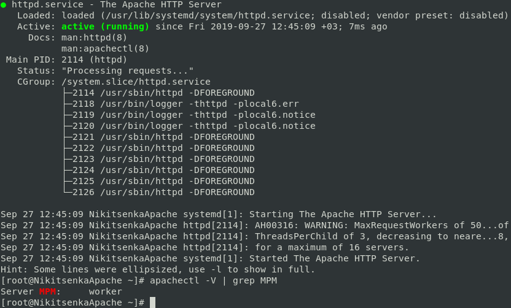

Set server fqdn to worker.name.surname:  
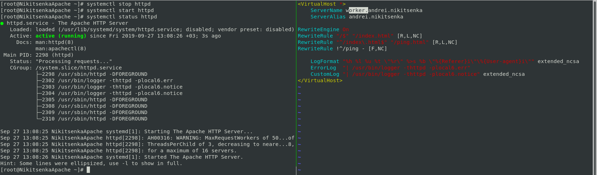

Set MaxRequestWorkers to 50. If necessary, change other module settings accordingly and start httpd server:  
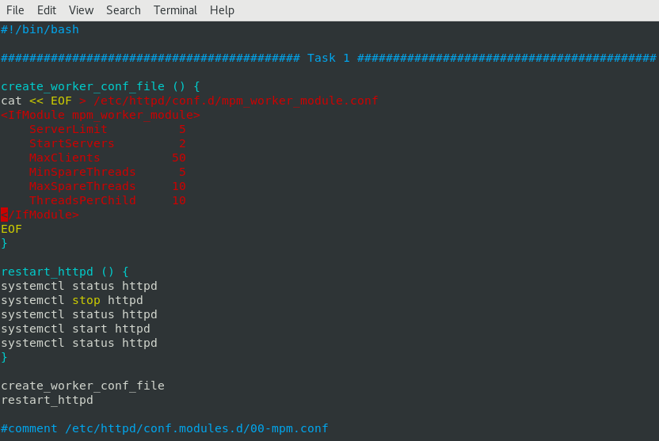

Show that httpd is using worker module:  

Using ab benchmarking tool prove that server can process only 50 simultaneous requests:  
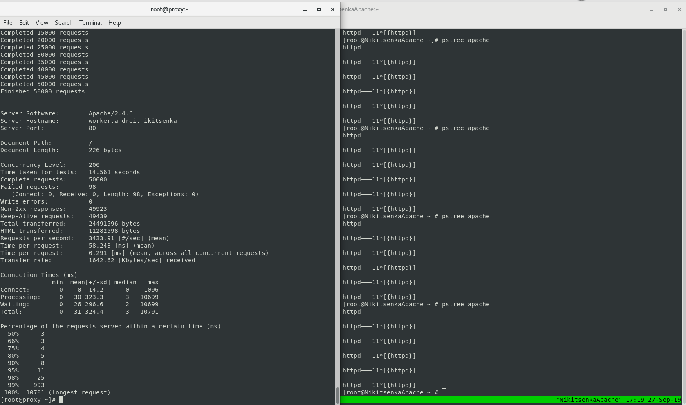

Show process tree, which includes workers and threads:  
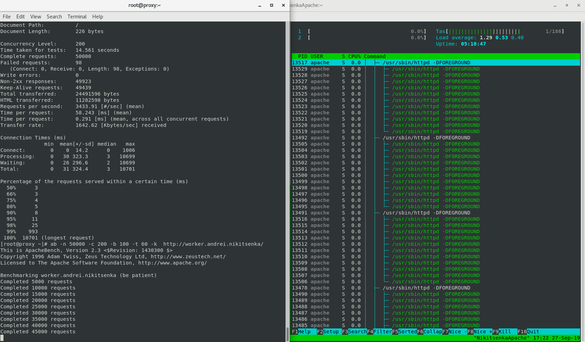

### MPM prefork module

Stop httpd server and configure non-threaded httpd server (i.e., prefork). Set server fqdn to prefork.name.surname:  

Set MaxRequestWorkers to 25. If necessary, change other module settings accordingly and start httpd server:  
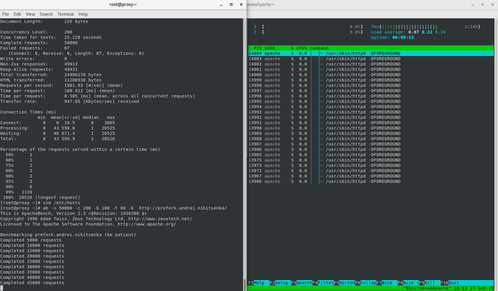

Show that httpd is using prefork module:  
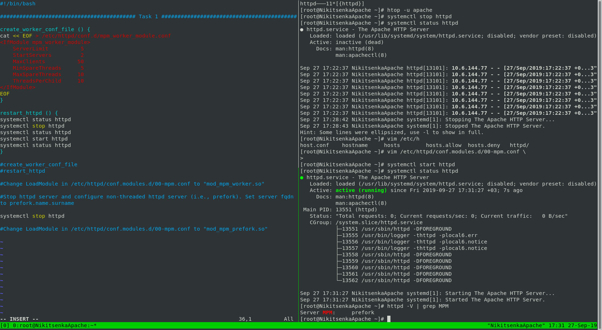

Using ab benchmarking tool prove that server can process only 25 simultaneous requests.
Show process tree, which includes workers:  

## Task 2

### Proxy

Review proxying. Review mod_proxy configuration.
Configure httpd as a forward proxy with authentication. Set proxy fqdn to forward.name.surname:  
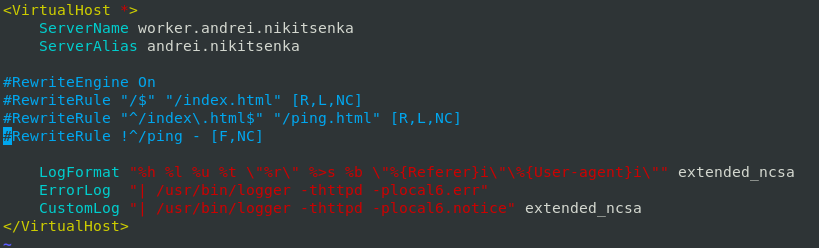
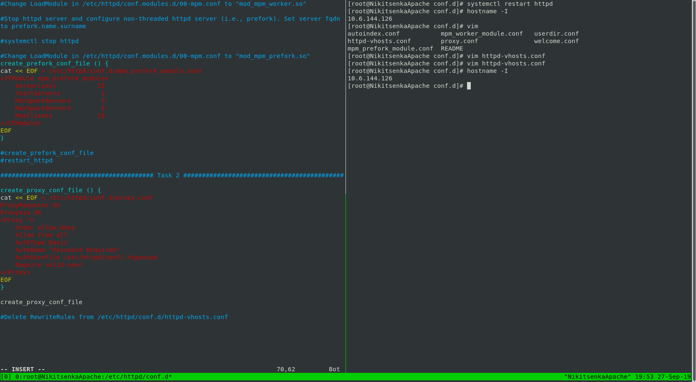
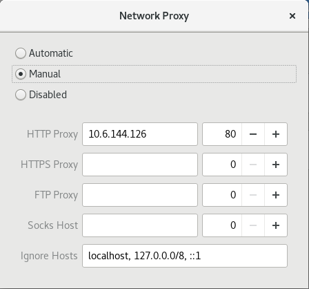

Grant access to internet via proxy only for user Name_Surname:  
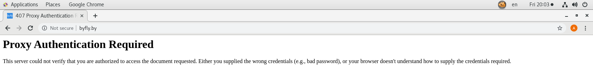
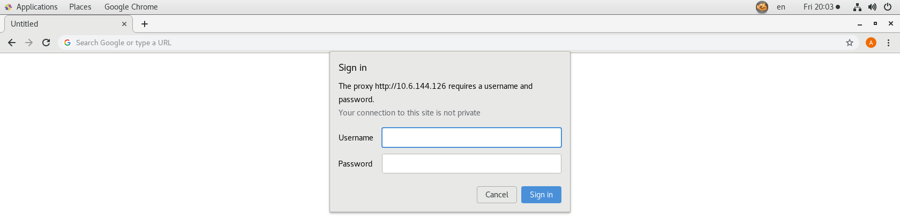
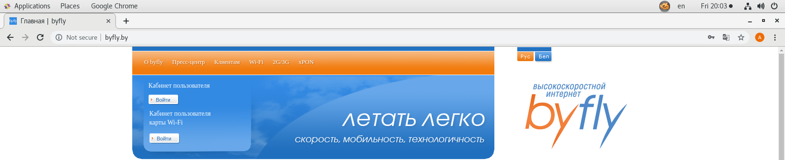

Configure httpd as a reverse proxy to any url of your choice. Set proxy fqdn to reverse.name.surname:  
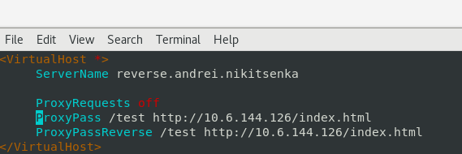
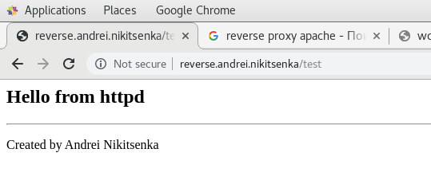
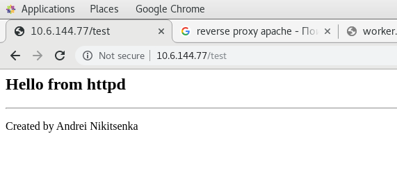

